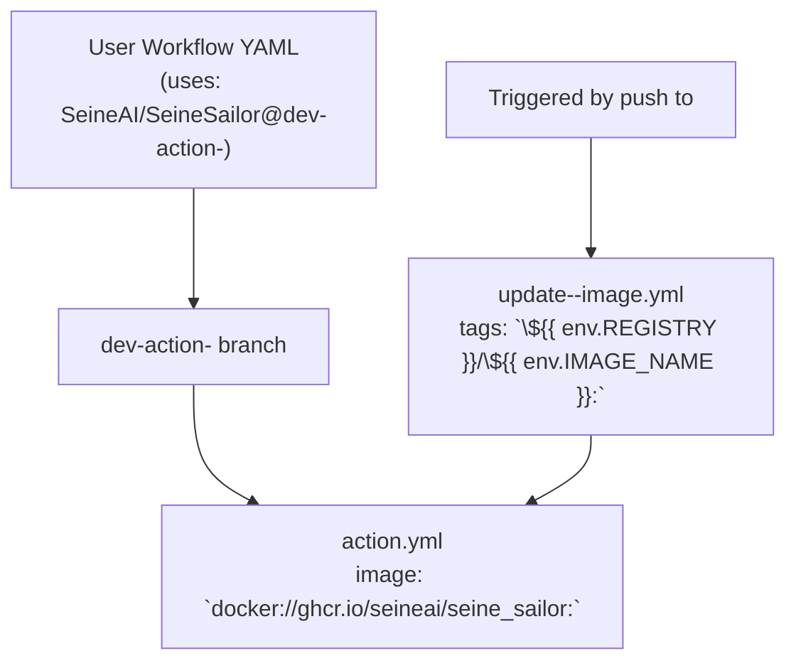

# Contributing to Seine Sailor

Welcome to the Seine Sailor project! This guide provides instructions for contributing to the project, including how to
work with the production and development environments.

## Production vs. Development Environments

### Production Environment

- **Branch:** `main`, whose `action.yml` file contains:
```yaml
runs:
  using: 'docker'
  image: "docker://ghcr.io/seineai/seine_sailor:stable"
```
This points to the `stable` docker image, which is built by [release.yml](../.github/workflows/release.yml) during 
release process.

- **Usage:** Normal users should use the stable version of the action in their workflows.

**Example Workflow for Normal Users:**

```yaml
jobs:
  seinesailor:
    runs-on: ubuntu-latest
    steps:
      - name: Run SeineSailor
        uses: SeineAI/SeineSailor@main # or release version tags
        env:
          GITHUB_TOKEN: ${{ secrets.GITHUB_TOKEN }}
          IBM_CLOUD_API_KEY: ${{ secrets.IBM_CLOUD_API_KEY }}
          WATSONX_PROJECT_ID: ${{ secrets.WATSONX_PROJECT_ID }}
        with:
          debug: false
```

### Development Environment

- **Branch:** `dev-action-only-do-not-merge-or-delete`, whose `action.yml` file contains:
```yaml
runs:
  using: 'docker'
  image: "docker://ghcr.io/seineai/seine_sailor:latest"
```
This points to the `latest` docker image, which is built by [update-latest.yml](../.github/workflows/update-latest.yml).

- **Usage:** Contributors should use the latest version of the action in their workflows to test and develop new
  features.

- **IMPORTANT** Don't delete or merge or modify the `action.yml` in `dev-action-only-do-not-merge-or-delete` branch. 
  It is the entrypoint to the `latest` docker image.

**Example Workflow for Contributors:**

```yaml
jobs:
  seinesailor:
    runs-on: ubuntu-latest
    steps:
      - name: Run SeineSailor
        uses: SeineAI/SeineSailor@dev-action-only-do-not-merge-or-delete
        env:
          GITHUB_TOKEN: ${{ secrets.GITHUB_TOKEN }}
          IBM_CLOUD_API_KEY: ${{ secrets.IBM_CLOUD_API_KEY }}
          WATSONX_PROJECT_ID: ${{ secrets.WATSONX_PROJECT_ID }}
        with:
          debug: false
```

## Release Process

### `release.yml`

The `release.yml` workflow is responsible for creating releases and tagging stable Docker images.

### `update-latest.yml`

The `update-latest.yml` workflow updates the latest Docker image whenever the source code in the `app` path changes in
the `main` branch.

## Custom Development Branches

If you want to separate your development and testing environments from others, you can create your own custom
development branches and Docker images. Here’s how:

1. **Copy `update-latest.yml`:**
    - Create a copy of the `update-latest.yml` file.
    - Modify it to build Docker images when code are pushed to your branches and tag the Docker image with your own 
      choice (we suggest to use the same name as your branch for easy identification). For example:

```yaml
name: Update Docker Image for branch <your-branch-name>

on:
  push:
    branches:
      - <your-branch-name>
    paths:
      - 'app/**'  # Only trigger when files in the app/ folder change
  workflow_dispatch:

jobs:
  build-and-push-dev:
    runs-on: ubuntu-latest
    permissions:
      packages: write
    env:
      REGISTRY: ghcr.io
      IMAGE_NAME: seineai/seine_sailor # different from repo name
    steps:
      - name: Set up Docker Buildx
        uses: docker/setup-buildx-action@v3.3.0
      - name: Log in to the Container registry
        uses: docker/login-action@v3.1.0
        with:
          registry: ${{ env.REGISTRY }}
          username: ${{ github.actor }}
          password: ${{ secrets.GITHUB_TOKEN }}
      - uses: actions/checkout@v4.1.6
        with:
          ref: <your-branch-name>  # Explicitly specify the branch name
      - name: Push Docker Image
        if: ${{ success() }}
        uses: docker/build-push-action@v5.3.0
        with:
          context: .
          file: ./Dockerfile
          push: true
          tags: |
            ${{ env.REGISTRY }}/${{ env.IMAGE_NAME }}:<your-tag> # we suggest to set <your-tag> 
            the same as <your-branch-name>
          platforms: linux/amd64
          provenance: false
          sbom: false
          cache-from: type=gha
          cache-to: type=gha,mode=max
```

2. **Create a Custom Development Branch:**
    - Create a new branch named `dev-action-<your-branch-name>`.
    - Update the `action.yml` in this branch to point to your custom Docker image tag.

**Example Custom Development Branch Setup:**

```yaml
name: Seine Sailor
description: Your custom development branch

runs:
  using: 'docker'
  image: "docker://ghcr.io/seineai/seine_sailor:<your-tag>"
```

**Example Workflow for Custom Development:**

```yaml
jobs:
  seinesailor:
    runs-on: ubuntu-latest
    steps:
      - name: Run SeineSailor
        uses: SeineAI/SeineSailor@dev-action-<your-branch-name>
        env:
          GITHUB_TOKEN: ${{ secrets.GITHUB_TOKEN }}
          IBM_CLOUD_API_KEY: ${{ secrets.IBM_CLOUD_API_KEY }}
          WATSONX_PROJECT_ID: ${{ secrets.WATSONX_PROJECT_ID }}
        with:
          debug: false
```

### Github's referencing mechanism




## Summary of Branches

- **`main`:** Stable branch for production use.
- **`dev-action-only-do-not-merge-or-delete`:** Development branch for contributors.
- **`dev-action-<your-branch-name>`:** Custom development branches for individual contributors.

## Conclusion

Thank you for contributing to the Seine Sailor project! We appreciate your efforts to improve the project and look
forward to your contributions. If you have any questions, feel free to open an issue or contact the maintainers.

Happy coding!